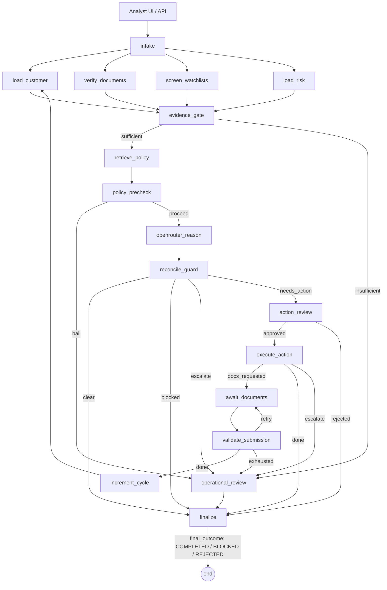

# Architecture

## System boundary



Grounding fans out across four allowlisted reads and fans back in at the
evidence gate. OpenRouter is the only live planner call. The model proposes;
`reconcile_guard` independently recomputes the mandate from typed facts and
fails closed in-node -- there is no separate `safe_failure` node. A single
`finalize` node keyed by `final_outcome` (`COMPLETED`/`BLOCKED`/`REJECTED`)
replaces the older `finalize_blocked`/`finalize_rejected` split.

## Control-plane principles

- The planner proposes; `app/policy.py` decides by evaluating the executable
  ontology (`app/ontology.py` over `data/ontology.json`). Rules are versioned
  data in a closed language; hard-stop rules are evaluated first and cannot be
  shadowed, and the verdict carries `rule_id@rule_version` plus the cited
  policy, which `policy_precheck` requires retrieval to have surfaced. `policy_precheck` runs before
  the model, and `reconcile_guard` independently checks the structured
  proposal, fails closed on any planner/tool failure, and routes straight to
  `finalize` on a sanctions block -- there is no separate failure node. A
  disagreement records `guardrail_override` and keeps the policy result.
- Case notes and retrieved documents are untrusted text. They travel through
  dedicated tools and planner context, never into the facts consumed by
  `policy.py`.
- Tool results remain typed and attributable to their source (`ToolCall`).
- Every decision records ontology path, facts, policy versions, tool calls,
  planner metadata, route, and trace.
- Reads and writes are structurally separate. A write pauses on LangGraph
  `interrupt()` with its full `action_payload`; approval resumes the graph.

## Planner modes and strict failure

`app/planner.py` exposes `normal` and `compromised_demo`. Both instantiate
`OpenRouterPlanner` and call OpenRouter live. In compromised mode the prompt
deliberately asks the model to treat the case note as an instruction, so the
guardrail can be demonstrated against an independent live proposal.

Provider timeout, malformed structured output, and retry exhaustion after a
planner has been constructed become explicit planner failure state that
`reconcile_guard` routes to `finalize`/`BLOCKED` or `operational_review`.
Missing credentials are rejected earlier by `select_planner()` and surface as
a client-visible configuration error; they do not enter the graph. The graph
never silently substitutes another runtime planner. Deterministic eval
doubles are reserved for offline tests and CI.

## Pending tasks and cycle semantics

The graph exposes three pending-task kinds:

- `ACTION_APPROVAL`: approval is required for `request_document` or
  `open_manual_review`; the payload names the exact documents or evidence.
- `DOCUMENT_SUBMISSION`: after an approved evidence request, the reviewer
  submits verified documents through the resume endpoint.
- `OPERATIONAL_REVIEW`: an action or infrastructure problem needs a human
  handoff before finalization.

`cycle_count` starts at one. A valid document submission routes to
`increment_cycle`, then repeats grounding, retrieval, precheck, OpenRouter,
and guard. `max_cycles` defaults to two. Invalid evidence loops back to
`await_documents` for another submission. If evidence submission is
exhausted, the graph routes to `operational_review`; acknowledgement then
continues to `finalize`. A sanctions stop routes straight to `finalize` with
`final_outcome = BLOCKED` and no approval token.

## Payload-aware idempotency

The reviewer’s interrupt ID is unique to a run. The action gateway's stable
idempotency key hashes the canonical case, action, and normalized payload. This
keeps two approval handles independent while ensuring retries or duplicate
approvals for the same requested document/evidence bundle return one ticket.
The demo protects the check-through-insert with an in-process lock; production
must enforce the same key with a durable unique constraint or compare-and-swap.

## Repository map

```text
app/workflow/       state schema, fan-out/fan-in graph, nodes, and route functions
app/planner.py      OpenRouter adapter and normal/compromised_demo prompt modes
app/policy.py       pure deterministic policy precheck and guardrail (façade over the ontology)
app/ontology.py     validating ontology loader + closed-language rule interpreter
app/tools.py        allowlisted reads, policy retrieval, and idempotent gateway
app/agent.py        public run/resume/approve/reject façade over the graph
app/checkpointing.py make_checkpointer(): Redis Stack -> in-memory fallback
app/api.py          FastAPI HTTP API + static UI; lifespan owns the agent and checkpointer
app/client.py       KYCClient: typed HTTP client app/ui.py uses to talk to app/api.py
app/cli.py          terminal demo and resume commands
evals/              deterministic eval doubles plus optional OpenRouter smoke test
```

## Runtime topology and scale boundary

`app/api.py`'s lifespan builds one `KYCExceptionAgent` and one checkpointer
(`app/checkpointing.py`) for the process. With `REDIS_URL` set and Redis
Stack running, graph state survives a restart; without it, the runtime falls
back to an in-memory checkpointer and logs a redacted warning (host:port and
exception type only -- never the raw URL or exception body, since
`REDIS_URL` can embed credentials). `GET /health` reports which backend is
live.

Pending-approval handles (`_pending_tasks`/`_results` in `app/agent.py`) stay
in process memory regardless of the checkpointer, so the runtime is a
**single replica**: Redis makes graph state durable, it does not make the
service horizontally scalable, and a restart still orphans in-flight
approvals. Moving those handles to Redis is the next step.

## Threat model excerpt

- Untrusted case notes cannot change policy evaluation. KYC-1044 proves the
  guardrail still emits `ESCALATE_COMPLIANCE` when a compromised proposal says
  `CLEAR`.
- Tool names are allowlisted and action payloads are built outside the model.
- Policy citations include `policy_id` and `version` for replay and audit.
- Planner/model changes replay the deterministic scenario suite before release.
- Duplicate side effects are prevented by payload-aware idempotency.
