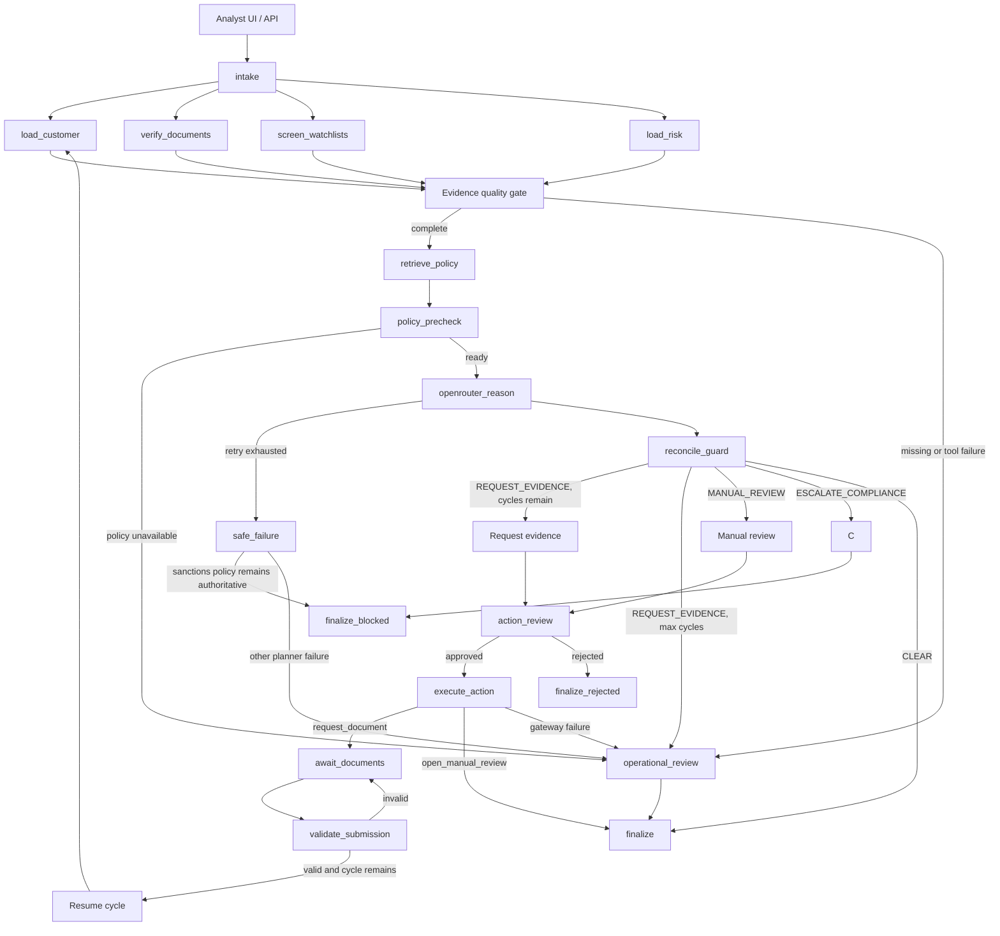

# Architecture

## System boundary



Grounding fans out across four allowlisted reads and fans back in at the
evidence gate. OpenRouter is the only live planner call. The model proposes;
the deterministic policy engine recomputes the mandate from typed facts.

## Control-plane principles

- The planner proposes; `app/policy.py` decides. `policy_precheck` runs before
  the model, and `reconcile_guard` independently checks the structured
  proposal. A disagreement records `guardrail_override` and keeps the policy
  result.
- Case notes and retrieved documents are untrusted text. They travel through
  dedicated tools and planner context, never into the facts consumed by
  `policy.py`.
- Tool results remain typed and attributable to their source (`ToolCall`).
- Every decision records ontology path, facts, policy versions, tool calls,
  planner metadata, route, and trace.
- Reads and writes are structurally separate. A write pauses on LangGraph
  `interrupt()` with its full `action_payload`; approval resumes the graph.

## Planner modes and strict failure

`app/planner.py` exposes `normal` and `compromised_demo`. Both instantiate
`OpenRouterPlanner` and call OpenRouter live. In compromised mode the prompt
deliberately asks the model to treat the case note as an instruction, so the
guardrail can be demonstrated against an independent live proposal.

Provider timeout, malformed structured output, missing credentials, and retry
exhaustion become explicit planner failure state. The safe failure router never
silently substitutes another runtime planner. Deterministic eval doubles are reserved
for offline tests and CI.

## Pending tasks and cycle semantics

The graph exposes three pending-task kinds:

- `ACTION_APPROVAL`: approval is required for `request_document` or
  `open_manual_review`; the payload names the exact documents or evidence.
- `DOCUMENT_SUBMISSION`: after an approved evidence request, the reviewer
  submits verified documents through the resume endpoint.
- `OPERATIONAL_REVIEW`: an action or infrastructure problem needs a human
  handoff before finalization.

`cycle_count` starts at one. A valid document submission routes to
`increment_cycle`, then repeats grounding, retrieval, precheck, OpenRouter,
and guard. `max_cycles` defaults to two. Invalid evidence or an exhausted
cycle budget routes to `finalize_blocked`; a sanctions stop routes directly to
`finalize` with no approval token.

## Payload-aware idempotency

The reviewer’s interrupt ID is unique to a run. The action gateway's stable
idempotency key hashes the canonical case, action, and normalized payload. This
keeps two approval handles independent while ensuring retries or duplicate
approvals for the same requested document/evidence bundle return one ticket.
The demo protects the check-through-insert with an in-process lock; production
must enforce the same key with a durable unique constraint or compare-and-swap.

## Repository map

```text
app/workflow/  state schema, fan-out/fan-in graph, nodes, and route functions
app/planner.py OpenRouter adapter and normal/compromised_demo prompt modes
app/policy.py  pure deterministic policy precheck and guardrail
app/tools.py   allowlisted reads, policy retrieval, and idempotent gateway
app/agent.py   public run/resume/approve/reject façade
app/server.py  HTTP API: /api/run, /api/resume, /api/approve, /api/reject
app/cli.py     terminal demo and resume commands
evals/         deterministic eval doubles plus optional OpenRouter smoke test
```

## Threat model excerpt

- Untrusted case notes cannot change policy evaluation. KYC-1044 proves the
  guardrail still emits `ESCALATE_COMPLIANCE` when a compromised proposal says
  `CLEAR`.
- Tool names are allowlisted and action payloads are built outside the model.
- Policy citations include `policy_id` and `version` for replay and audit.
- Planner/model changes replay the deterministic scenario suite before release.
- Duplicate side effects are prevented by payload-aware idempotency.
