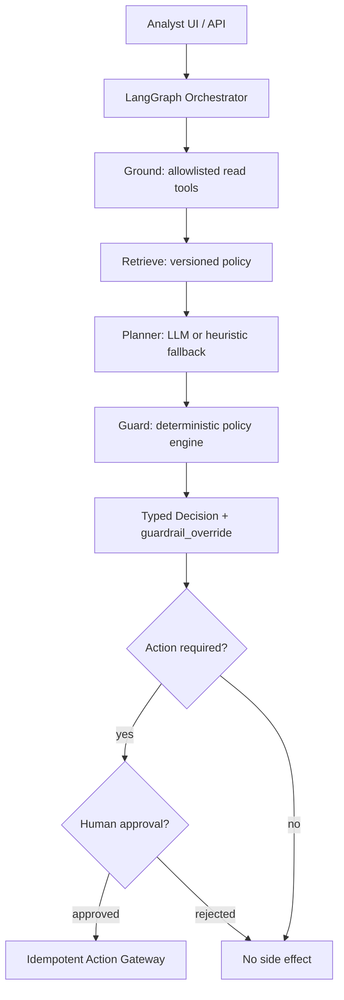

# Architecture

## System boundary

## Control-plane principles

- The planner proposes; `policy.py` decides. It recomputes the mandated
  outcome from typed, tool-sourced facts on every run and overrides the
  proposal on disagreement -- this is enforced in code (`app/policy.py`,
  `guard()`), not by prompt instruction.
- Case notes and any other free text are untrusted. They are fetched through
  a dedicated `get_case_note` tool, never merged into the facts `policy.py`
  reads, and explicitly labeled as non-authoritative in the planner prompt.
- Tool results remain typed and attributable to their source (`ToolCall`).
- Every decision records ontology path, facts, policy versions, tool calls,
  planner rationale, guardrail verdict, and trace -- an auditable trajectory.
- Reads and writes are structurally separate: reads happen inline in the
  graph; writes pause on `interrupt()`, carry the full `action_payload`
  (not just an action name), and execute through an idempotency-keyed
  gateway. The approval handle a reviewer clicks (`ApprovalRequest.approval_key`,
  LangGraph's own interrupt id) is deliberately a *different* value from the
  action gateway's dedup key (deterministic `sha256(case_id:action)`): the
  first must be unique per run so two runs of the same case+action never
  collide; the second must be stable per case+action so approving either
  run still produces exactly one ticket.
- One `KYCExceptionAgent` per process, shared across requests. Planner and
  language are `run()`/`approve()` arguments, not part of construction --
  an earlier revision built one agent per planner choice, which made
  approving a pending run ambiguous whenever two requests picked different
  planners for the same case. See `agent.py`'s class docstring.

## Planner seam

`app/planner.py` defines a `Planner` protocol (`propose(case_id, facts,
citations, case_note) -> LLMProposal`) with three implementations:
`OpenRouterPlanner` (real LLM, structured output), `HeuristicPlanner`
(offline, deterministic fallback), and `AdversarialPlanner` (simulated
compromised model, used only for red-team demos and the regression eval).
`select_planner()` auto-detects which to use from environment/CLI flags.
None of them can bypass `policy.py`; the graph always runs `guard` after
`reason`.

## Presentation-layer i18n

`app/i18n.py` is the only module allowed to know about display language.
Graph nodes and `policy.py`/`planner.py` produce stable English keys and
parameters (`PolicyVerdict.reason_key`, `LLMProposal.rationale_key`); all
language rendering happens once, at `agent.py:_to_decision`. Deterministic
content (verdict reasons, overrides, heuristic/adversarial rationale,
citations, UI chrome) renders offline for English and Vietnamese. A real
LLM's free-form rationale gets one best-effort translation call
(`i18n.translate_via_llm`) that returns `None` on any failure so the caller
can fall back to the English original instead of crashing or silently
showing a broken translation.

## Failure taxonomy

| Layer | Example | Detection | Response |
|---|---|---|---|
| Data | stale customer profile | freshness metadata | retry or abstain |
| Retrieval | irrelevant policy | labeled citation eval | hybrid rerank / filter |
| Planning | wrong tool sequence, hallucinated outcome | trajectory eval, guardrail override log | prompt/model regression, review override rate |
| Injection | case note instructs the model | adversarial planner eval (`evals/run_evals.py`) | guardrail override (already enforced) |
| Tool | timeout or bad schema | contract validation | retry with budget |
| Policy | missing jurisdiction | rule coverage test | block resolution |
| Action | duplicate ticket | idempotency check on `execute_approved_action` | return prior result |

## Threat model excerpt

- untrusted text in case notes or retrieved documents -- mitigated by
  routing case notes through a separate tool and never feeding them to
  `policy.py`; demonstrated live with `KYC-1044` and the adversarial planner;
- cross-tenant data leakage -- mitigate with tenant-scoped retrieval and
  per-tool identity in production (not modeled in this single-tenant demo);
- over-privileged tool credentials -- `DomainTools.call` allowlists tool
  names; `execute_approved_action` allowlists actions separately;
- policy version drift -- citations carry `policy_id` + `version`; replay a
  golden case suite before activating a new policy version;
- model or prompt changes that alter trajectories -- pin planner/model
  version in the trace, replay `evals/run_evals.py` on every change;
- duplicate side effects after retries -- `execute_approved_action` is
  idempotency-keyed and safe to call more than once.
