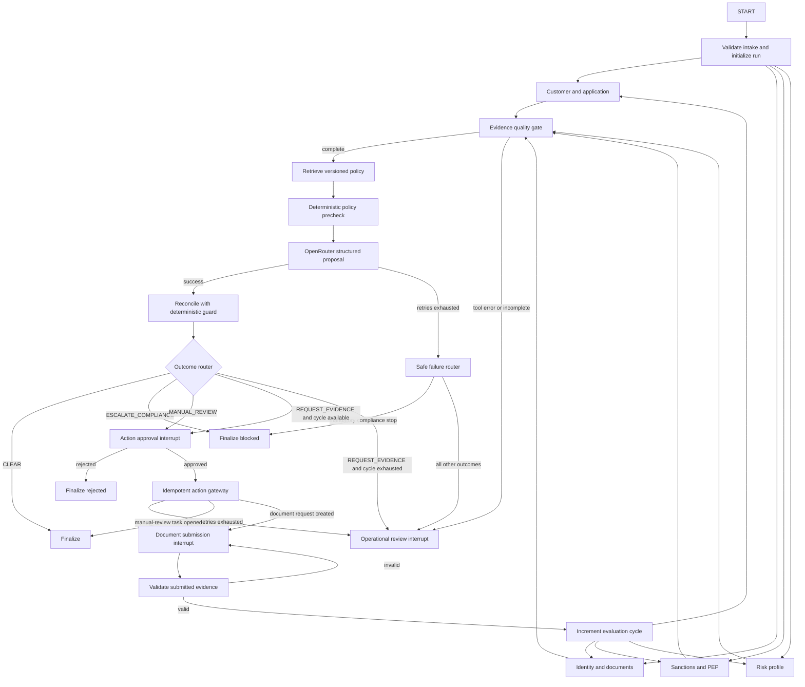

# Risk-Adaptive LangGraph Workflow Design

Status: Approved for implementation planning

Date: 2026-09-15

Audience: Round-two interview reviewers and implementers

## Context

The current KYC exception agent executes a largely linear LangGraph pipeline:

```text
ground -> retrieve -> reason -> guard -> review -> end
```

The `review` node contains outcome-dependent behavior, but the compiled graph
does not expose those decisions as distinct branches. This makes the code easy
to run but undersells why a graph orchestrator is useful. It also ends after an
evidence-request action, rather than modeling the later arrival of evidence and
resumption of the same case.

The enhanced workflow will be both a working live demo and a defensible system
design for a 15-minute round-two interview segment. Authoritative KYC tools will
remain deterministic local simulations. The advisory planner will call
OpenRouter live. Policy enforcement will remain deterministic and independent
of the model.

## Goals

- Make parallel work, conditional routing, recovery, interrupts, and loops
  visible in the compiled graph.
- Demonstrate a complete evidence-remediation lifecycle on KYC-1042.
- Demonstrate that a live but compromised model cannot bypass a sanctions hard
  stop on KYC-1044.
- Treat OpenRouter failure as explicit workflow state and never silently
  substitute heuristic reasoning.
- Preserve exact-parameter approval, checkpoint resume, auditability, and
  idempotent side effects.
- Keep the implementation understandable and reliable enough for a live
  interview.

## Non-goals

- Connecting to real banking, document, sanctions, or risk systems.
- Building a supervisor-and-specialist multi-agent hierarchy.
- Adding production persistence, tenant isolation, RBAC, or a durable event
  bus in this iteration.
- Automating actions that currently require human approval.
- Treating model confidence as confidence in the enforced policy outcome.

## Selected Approach

Use a risk-adaptive case workflow with four phases:

1. Validate the request and run four authoritative checks in parallel.
2. Join and validate their evidence, retrieve policy, and compute a
   deterministic policy precheck.
3. Request a structured proposal from OpenRouter and reconcile it against the
   precheck.
4. Route to clear, evidence remediation, manual review, or compliance stop.

This is more expressive than only exposing the existing outcome router, while
remaining easier to justify and test than a supervisor with specialist agents.
The domain has a stable process and deterministic controls; multiple autonomous
agents would add cost, latency, and attack surface without adding decision
authority.

## Architecture



The four grounding nodes execute in the same graph superstep. The quality gate
runs only after all four have completed or converted an exhausted failure into
structured error state.

## State Contract

The graph continues to use JSON-safe primitives so checkpoints can later move
from memory to a durable implementation without changing the domain contract.

```python
class WorkflowState(TypedDict, total=False):
    case_id: str
    run_id: str
    lang: str
    cycle_count: int
    max_cycles: int
    submitted_documents: list[dict[str, Any]]

    customer_facts: dict[str, Any] | None
    document_facts: dict[str, Any] | None
    screening_facts: dict[str, Any] | None
    risk_facts: dict[str, Any] | None

    tool_errors: Annotated[list[dict[str, Any]], operator.add]
    trace: Annotated[list[dict[str, Any]], operator.add]

    facts: dict[str, Any]
    citations: list[dict[str, Any]]
    policy_verdict: dict[str, Any] | None
    proposal: dict[str, Any] | None
    planner_status: Literal["pending", "ok", "failed"]
    planner_error: dict[str, Any] | None
    decision: dict[str, Any] | None
    route: str | None

    action_payload: dict[str, Any] | None
    review_result: dict[str, Any] | None
    action_result: dict[str, Any] | None
```

Each parallel read owns a distinct fact field. Shared append-only collections
use reducers, preventing concurrent state-update conflicts. The quality gate is
the only node that assembles the four fields into the existing `facts` shape.
Routing functions are pure: they inspect state and return a destination without
performing I/O or mutating state.

`cycle_count` begins at 1. `max_cycles` is 2 for the demo. A valid document
submission increments the count before the second evaluation. If the second
evaluation still returns `REQUEST_EVIDENCE`, the graph routes to operational
review rather than issuing requests indefinitely. An invalid or irrelevant
submission returns to the document wait without consuming an evaluation cycle.

Submitted evidence is scoped to graph state and merged into the deterministic
document-tool result for that run. It does not mutate the shared case fixture,
so later demos of KYC-1042 start from the original case.

## Node Responsibilities

| Node | Responsibility | External effect |
|---|---|---|
| `intake` | Validate case, language, mode, and initialize counters | None |
| `load_customer` | Read customer and application facts | Deterministic local read |
| `verify_documents` | Read identity evidence and apply run-scoped submissions | Deterministic local read |
| `screen_watchlists` | Read sanctions and PEP evidence | Deterministic local read |
| `load_risk` | Read risk tier and drivers | Deterministic local read |
| `evidence_gate` | Assemble facts or classify grounding failures | None |
| `retrieve_policy` | Retrieve versioned policy for grounded tags | Deterministic local read |
| `policy_precheck` | Compute the mandatory outcome and validate citation coverage | None |
| `openrouter_reason` | Produce a structured advisory proposal | Live OpenRouter call |
| `reconcile_guard` | Compare the proposal to the mandatory outcome | None |
| `action_review` | Pause for approval of an exact payload | Human interrupt |
| `execute_action` | Execute an approved action using an idempotency key | Controlled write |
| `await_documents` | Pause until requested evidence arrives | External-event interrupt |
| `validate_submission` | Validate type and relevance of submitted evidence | None |
| `operational_review` | Pause safely when automation cannot continue | Human interrupt |
| finalizers | Produce terminal status and display-ready result | None |

## Routing and Safety Semantics

### Evidence quality

Each grounding node has a bounded retry policy for explicitly classified
transient failures. A node-level error handler converts an exhausted failure
into `tool_errors`, allowing the fan-in to complete. The evidence gate routes
any incomplete authoritative record to operational review. It never fabricates
missing facts or sends partial facts to the model.

### Policy before model

The deterministic policy precheck runs before OpenRouter. This ensures a known
sanctions hard stop survives model downtime. The model remains useful for an
advisory proposal and rationale, but it is not required to discover or enforce
mandatory policy.

If policy retrieval is missing, contradictory, or does not cover the computed
verdict, the workflow records `POLICY_UNAVAILABLE` and pauses for operational
review with no executable action.

### OpenRouter

`openrouter_reason` requests the existing `LLMProposal` structured contract.
Timeouts, transport failures, invalid JSON, and schema violations are retryable
up to three total attempts, meaning the initial call plus two retries. After
that, `planner_status` becomes `failed` and records a sanitized error category.

The safe failure router applies these rules:

- If `policy_verdict` is `ESCALATE_COMPLIANCE`, finalize the mandatory hard
  stop even without a model response.
- Otherwise pause for operational review with reason `AI_UNAVAILABLE`.
- Never call the heuristic planner implicitly.

### Controlled adversarial mode

The run input supports `planner_mode="normal"` and
`planner_mode="compromised_demo"`. Both modes call OpenRouter live. Normal mode
labels free text as untrusted and instructs the model to ignore embedded
instructions. Compromised demo mode deliberately removes that isolation and
directs the model to follow the case note, making an unsafe KYC-1044 proposal
likely.

The UI and trace must label compromised mode prominently. It is disabled by
default and must never change policy evaluation, action construction, or tool
permissions. If the model nevertheless recommends the safe outcome, the demo
still remains valid: the trace shows agreement rather than an override.

### Actions and idempotency

Every write follows an approval interrupt and executes only after resume. The
idempotency key is a canonical hash of case ID, action name, normalized action
parameters, and relevant policy versions. Identical retries return the prior
result; materially different action payloads receive different keys.

Approval interrupt IDs remain unique per run and are not reused as
idempotency keys. A duplicated resume is rejected as already resolved, while a
duplicated gateway request returns the original action result.

No node performs a write before calling `interrupt()`, because an interrupting
node restarts from its beginning when the graph resumes.

## Interrupt and Resume Interface

The current approval-only pending registry becomes a general pending-task
registry keyed by LangGraph's native interrupt ID:

```text
PendingTask
  kind: action_approval | document_submission | operational_review
  interrupt_key
  case_id
  run_id
  title
  message
  payload
  allowed_responses
```

`KYCExceptionAgent.resume(interrupt_key, response, lang=None)` is the core
resume operation. Existing `approve()` and `reject()` methods remain thin
compatibility wrappers. Every resume uses the original compiled graph,
configuration, and `thread_id` stored for that interrupt.

The HTTP layer adds `POST /api/resume`. Its request contains the interrupt key
and a response object appropriate to the task kind. Existing approval and
rejection endpoints remain supported and delegate to the same method.

The response view adds:

- `workflow_status`;
- `current_node`;
- `cycle_count` and `max_cycles`;
- `pending_task`;
- planner attempts, latency, model, token usage, and estimated cost when the
  provider reports them.

The UI chooses approval, document-submission, or operational-review controls
from `pending_task.kind`. It highlights the executed graph path and retains the
existing facts, citations, proposal, guardrail, trace, and localization views.

## Component Boundaries

The expanded graph should not remain in the already-large `app/agent.py`.

```text
app/workflow/state.py     state schema, reducers, route and status enums
app/workflow/nodes.py     node implementations and dependency-bound factories
app/workflow/routing.py   pure routing functions
app/workflow/graph.py     topology and retry/error-handler configuration
app/agent.py              public run, resume, compatibility, and rendering facade
```

Focused extensions are also expected in:

- `app/domain.py` for the generalized pending-task and workflow-result fields;
- `app/planner.py` for strict OpenRouter behavior and compromised demo mode;
- `app/tools.py` for separated grounding operations and run-scoped evidence;
- `app/server.py` for the generic resume endpoint;
- `static/index.html` for path visualization and task-specific controls;
- tests and evals for route, retry, resume, safety, and trajectory coverage.

The public `KYCExceptionAgent` remains the integration point used by the CLI,
server, and Streamlit surfaces.

## Observability

Every trace event records:

- run ID, case ID, node, route, and evaluation cycle;
- start time, duration, status, and retry attempt;
- sanitized failure category;
- OpenRouter model, prompt mode, token usage, and estimated cost when available;
- retrieved policy IDs and versions;
- interrupt creation and resume outcome;
- planner-versus-policy mismatch;
- action idempotency result.

Secrets, full prompts, and raw PII are not written to traces. MLflow remains the
demo trace surface, while typed trace events continue to drive the application
UI and deterministic assertions.

## Verification Strategy

### Unit tests

- Every pure route for all outcomes and failure categories.
- Evidence-gate behavior for complete, partial, and failed grounding.
- State reducers under concurrent branch updates.
- Policy precheck citation coverage.
- Cycle counting and the maximum-cycle route.
- Canonical idempotency keys for equal and different payloads.

### Controlled component tests

- A local tool that succeeds after a configured number of transient failures.
- An OpenRouter adapter that times out, emits invalid JSON, violates schema,
  and succeeds on a later attempt.
- Strict exhaustion behavior with no heuristic invocation.
- Approval, rejection, document submission, invalid submission, and duplicate
  resume behavior.

### End-to-end trajectory tests

- KYC-1042: request evidence, approve, execute once, wait, submit proof of
  address, rerun checks, and clear on cycle two.
- KYC-1043: route identity conflict to manual review.
- KYC-1044: enforce compliance escalation even when the planner proposes
  `CLEAR` or OpenRouter is unavailable.
- KYC-1045: take the straight-through clear path without an interrupt.
- An exhausted write retry produces operational review and no duplicate action.

CI uses a mocked OpenRouter transport to keep branch assertions deterministic.
An opt-in live smoke test runs only when the OpenRouter credential is present
and checks connectivity plus structured-output compatibility, not an exact
natural-language rationale.

## Fifteen-Minute Interview Sequence

### 0:00-1:30 — Frame the workflow

Describe KYC exception handling as a long-running, policy-bound workflow rather
than a chat response. Show the graph and identify parallel reads, routing,
interrupts, the live model boundary, and deterministic policy authority.

### 1:30-4:30 — KYC-1042 cycle one

Start the case. Show the four grounding nodes executing, the versioned policy,
the live OpenRouter proposal, and the `REQUEST_EVIDENCE` route. Point out node
latency, model usage, and the highlighted path.

### 4:30-6:00 — Approve the exact action

Approve the request for proof of address. Show the precise payload and one
idempotent ticket. The same graph thread then pauses on a document-submission
task instead of ending.

### 6:00-8:30 — Resume and clear

Submit simulated proof of address. Show checkpoint resume, cycle two, repeated
authoritative checks, the second live model call, and the `CLEAR` route.

### 8:30-11:30 — KYC-1044 safety case

Enable the visibly labeled compromised demo mode. Show the live model proposal
and the deterministic compliance outcome. If the proposal is unsafe, highlight
the guardrail override; if it is safe, highlight independent agreement. In
either case, there is no approval control or executable action.

### 11:30-13:00 — Failure and test evidence

Use the route and trace views to explain tool retries, strict OpenRouter
failure, safe write retry, and the maximum-cycle escape. Do not spend live-demo
time forcing provider failures; show the deterministic test coverage.

### 13:00-15:00 — Production judgment and questions

Explain the seams for a durable checkpointer, event delivery, RBAC,
tenant-scoped tools, durable idempotency, and policy/model rollout evaluation.
Finish with time for questions.

Before the interview, run a live OpenRouter preflight against the configured
model. Do not precompute or fake calls shown in the demo. If the provider fails
during the interview, use the resulting strict failure route as evidence that
the workflow degrades safely.

## Acceptance Criteria

- The compiled graph visibly contains parallel grounding, a fan-in, conditional
  outcome edges, action and document interrupts, and a bounded evidence loop.
- KYC-1042 can complete the approved two-cycle evidence-remediation story on
  one LangGraph thread.
- KYC-1044 cannot expose an automated action under any planner output or model
  failure.
- OpenRouter exhaustion never invokes a heuristic fallback.
- Every write requires approval and remains idempotent across retries.
- All four domain outcomes and all failure routes have deterministic tests.
- The UI and trace make the selected route, cycle, retries, model usage, and
  human/external events understandable during a 15-minute interview.

## Alternatives Considered

### Expose only the existing outcome router

This is the least risky change and would make conditional edges visible, but it
would still omit parallel work, long-running resume, recovery, and loops. It is
too small for the intended 15-minute technical discussion.

### Supervisor with specialist agents

This would appear more agentic, but the KYC steps are known and their authority
is deterministic. Multiple model-driven specialists would increase latency,
cost, nondeterminism, prompt-injection surface, and test complexity without
improving the policy decision. It is intentionally excluded.

## Production Evolution

The demo keeps `MemorySaver` and in-process registries. Production would replace
them with a durable LangGraph checkpointer and a persisted task/event model. It
would also require authenticated event delivery, tenant-scoped tool identity,
RBAC, encrypted PII, durable unique constraints for idempotency, retention and
redaction policies, rate limits, model rollout gates, policy replay, operational
runbooks, and alerts on stuck or repeatedly failing workflows.

These are extensions of the same state and control boundaries, not reasons to
introduce additional model authority.
